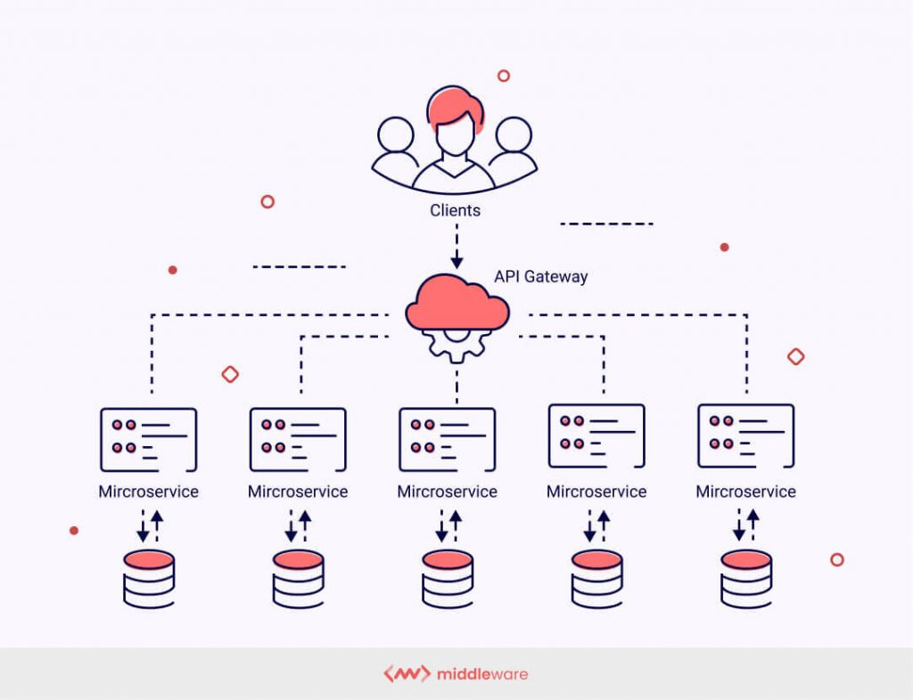

Microservices is a cloud-native architectural approach in which a single
application is composed of many loosely coupled and independently deployable
smaller components, or services. These services typically

-have their own technology stack, inclusive of the database and data management
model
-communicate with one another over a combination of REST APIs, event streaming,
and message brokers
-Code can be updated more easily - new features or functionality can be added
without touching the entire application
-Teams can use different stacks and different programming languages for
different components.
-Components can be scaled independently of one another, reducing the waste and
cost associated with having to scale entire applications because a single
feature might be facing too much load.

here api gateway provides a single point of contact for the client and we do not need to
use different end points for every API.
In between there is Hystrix Dashboard used for fault tolerance.
Two microservices contact each other with the help of HTTP.

This was introduced to overcome issues with MONOLITHIC ARCHITECTURE problems.
-for a single bug may down your whole application
-single change needs redeployment for whole application.

There were some advantages too-
-simple to develop
-simple to build and deploy
-problem of n/w latency are relatively less

